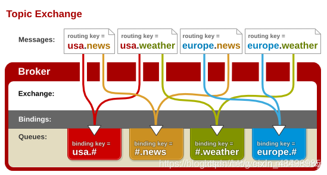
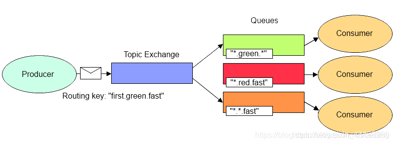

# RabbitMQ
## 简介
### MQ
    Message Queue 消息队列
### RabbitMQ
    Erlang语言 ，AMQP协议。
#### AMQP协议
**简介**

    Advanced Message Queue，高级消息队列协议。

**特点**

面向 <r>**消息**</r>、 **队列**、 **路由** *(包括点对点和发布/订阅) *、 **可靠性** 、 **安全**

应用于 **企业系统内**、数据 **一致性**、 **稳定性**、 **可靠性** 高。 **吞吐量**次之

## 原理

Producer 建立链接 connection ，connection 多路复用建立虚拟链接channel，
Producer 发送消息  指定 Exchange routingkey

### 基本概念
1. Channel(信道)

    多路复用 一条 双向数据流通道。真实TCP链接的虚拟链接，复用TCP链接
2. Producer（消息的生产者）

    发送消息到队列 客户端程序
3. Consumer（消息的消费者）

    消息队列取消息 客户端程序
4. Message（消息）
    消息头 消息体
    * 消息头

      * routing-key
      * priority
      * delivery-mode

    * 消息体

5. Routing Key（路由键）

    消息头属性 。路由规则。交换机转发路径 255字节
6. Queue（消息队列）

    数据结构。1对多订阅 一条消息一个订阅处理
7. Exchange（交换器｜路由器）

   Producer到Queue的匹配。接收消息，路由规则转发。 没有队列丢弃消息。
   4种策略： fanout direct topic headers
8. Binding（绑定）

    路由规则 基于Binding Key  Exchange和Queue链接
    交换器 油Binding构成的路由表
9.  Binding Key（绑定键）

    Exchange 与 Queue 绑定关系。匹配Routing key
10. Broker

    RabbitMQ Server 服务器实体
### 调度策略
    Exchange 接收生产者消息，按规则，转发 一个或多个队列

    影响因素： Exchange type ， Binding Key ， 消息的标记信息（Routing Key 和 headers）

    生产者 发消息 指定Routing Key。Exchange type ， Binding key 定义是确定

### Exchange 类型
#### Fanout （扇形）
    订阅模式｜广播模式
    Exchange 将所有发送到该交换器的消息络油到与该交换器绑定的消息队列中。
    不进行 RoutingKey 与BindingKey 匹配，发送到所有绑定的Queue 
    转发消息最快
    
#### Direct
    路由模式
    Routing Key 与BindingKey 完全匹配。
    Exchange 默认模式
    + 默认Exchange
      + 与所有队banding 
      + BindingKey 为Queue名字

    
#### Topic 
    通配符匹配
    按正则表达式模糊匹配
    RountingKey 用. 分割
    BindingKey 也用.分割 存在通配符 *（一个单词）与#（一个字符）
    
    
#### headers （首部）
    不需要routingKey,通过 key-value 匹配
    Exchange : 包含 
        + to（队列）
        + Arguments（x-match:any|all,{key:value},...}）
          + x-match
            + any 消息携带headers有一个满足一个队列定义的多个参数arguments中的一个就能匹配。键和值完全匹配
            + all 消息头携带的key-value 完全匹配上
          + key-value 
            + alternate-exchange 备用交换机
    message 
        {key:value}
    
    

 